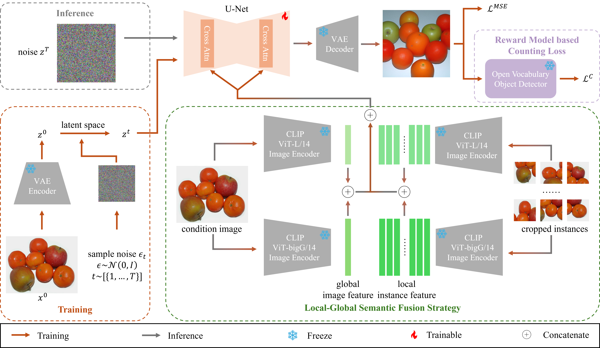

# 🐾 Prompt-Free Conditional Diffusion for Multi-object Image Augmentation

<div align="center">
  <a href="https://arxiv.org/abs/2505.xxxxx">
    
  </a>
  <a href="https://huggingface.co/0why0/PFCD">
    
  </a>

</div>

<div>
  <p align="center" style="font-size: larger;">
    <strong>IJCAI 2025</strong>
  </p>
</div>

<p align="center">

<p>

<br>

## News

* **2025-05:** 🔥 Code and weights are released!
* **2025-04:** 🤗 Our paper is accepted by **IJCAI 2025**.

## Prepare Environment

```bash
conda create -n env_name python=3.11 -y
conda activate env_name
pip install -r requirements.txt
```

## Prepare Dataset

1. Download the [COCO dataset](https://cocodataset.org/#download).
2. Unzip the dataset and place it in the `data` folder.
3. Change the `data_root` in `dataset/coco.py` to the path of your dataset.

## Prepare Pipeline
Run `inference/inference_image_variation_sdxl.py` to organize the pre-trained model weights.

## Training Scripts

To train the model, you can use the provided training script:
```bash
bash scripts/sdxl512/train.sh
```
This will start the training process with the specified configuration. You can modify the `train.sh` script to adjust the training parameters, such as batch size, learning rate, and number of epochs.

We also provide the trained model weights for the COCO dataset. You can download them from [here](https://huggingface.co/0why0/PFCD/tree/main/weights).

## Evaluation
### Downstream Task Evaluation

1. Generate training split images using the trained model:
```bash
bash scripts/generate/generate_train.sh
```

2. Label the generated images using Grounding DINO and SAM:
```bash
bash scripts/labeling/label_train.sh
bash scripts/labeling/label_train_seg.sh
```

3. Train the downstream task model using the labeled images:

Use [Detectron2](https://github.com/facebookresearch/detectron2) to train the downstream task model.

### Generation Quality Evaluation

1. Generate validation split images using the trained model:
```bash
bash scripts/generate/generate_val.sh
```

2. Evaluate the generated images using FID, Diversity Score(LPIPS), Image Quantity Score(IQS):
```bash
python utils/metrics.py 
python iqs/evaluation.py
```

Note: To evaluate with YOLOv8, you need to modify the dataset structure to match the YOLOv8 format.

### Gradio Demo
To run the Gradio demo, you can use the following command:
```bash
python app_gradio.py --checkpoint_path path/to/ckpt
```

## Acknowledgements
This repository is built upon the following projects:

- [Diffusers](https://github.com/huggingface/diffusers)
- [Grounding DINO](https://github.com/IDEA-Research/GroundingDINO)
- [Segment Anything](https://github.com/facebookresearch/segment-anything)
- [Detectron2](https://github.com/facebookresearch/detectron2)
- [YOLOv8](https://github.com/ultralytics/ultralytics)

Thanks to the authors for their great work!

## Citation
If you find this code useful for your research, please consider citing our paper:

```bibtex
@article{wang2025prompt,
  title={Prompt-Free Conditional Diffusion for Multi-object Image Augmentation},
  author={Wang, Haoyu and Zhang, Lei and Wei, Wei and Ding, Chen and Zhang, Yanning},
  journal={IJCAI},
  year={2025},
}
```
